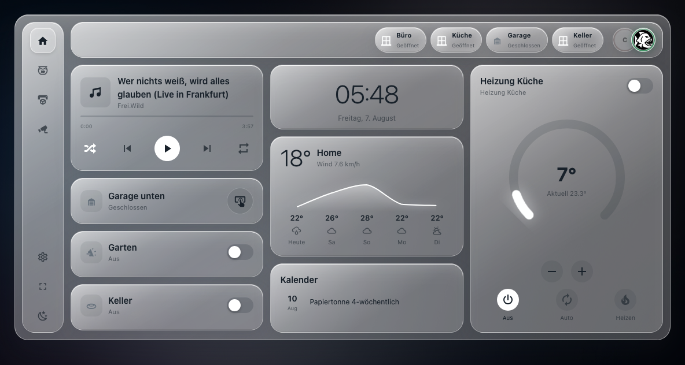

<div align="center">

# HA-OS

**Ein Dashboard für Home Assistant, das aussieht wie ein Betriebssystem.**

Eine durchgehende Glasfläche mit Seitenleiste, Kopfzeile und frei gewichteten
Rastern — in die jede installierte Lovelace-Karte passt.

[](https://github.com/Piranha1605/ha-os/releases)
[](https://hacs.xyz)
[](LICENSE)



</div>

---

## Worum es geht

Home Assistant zeigt Karten in einem Raster — jede für sich eine Insel. HA-OS
legt darüber eine **Hülle**: eine einzige Glasfläche mit fester Navigation, in
der die Karten sitzen wie Fenster auf einem Schreibtisch. Gedacht für das
Wandtablet, das den ganzen Tag an derselben Stelle hängt.

Drei Dinge sind dabei wichtiger als die Optik:

**Es bleibt dein Home Assistant.** Die Shell kennt selbst keine Kartentypen.
In ihre Raster passt alles, was installiert ist — Mushroom, Bubble Card,
button-card, die Standardkarten. Ausgewählt über eine Liste, eingestellt mit
dem echten HA-Editor der jeweiligen Karte. Kein YAML nötig.

**Es ruckelt nicht.** Das DOM wird **einmal** aufgebaut; danach ändern sich nur
Texte, Klassen und Stilwerte. Zustandsmeldungen werden auf die Entitäten
gefiltert, die gerade sichtbar sind. Karten überleben den Seitenwechsel.

**Alles ist im Editor einstellbar.** Maße, Farben, Glasstärke, Seiten,
Hintergrundbild — ohne einmal in eine Datei zu sehen.

## Installation über HACS

1. HACS → ⋮ → **Benutzerdefinierte Repositories**
2. `https://github.com/Piranha1605/ha-os` eintragen, Kategorie **Dashboard**
3. HA-OS suchen und herunterladen
4. Browser hart neu laden — Cmd+Shift+R bzw. Strg+F5

Die Ressource trägt HACS selbst ein. Falls nicht, unter Einstellungen →
Dashboards → ⋮ → Ressourcen von Hand: URL `/hacsfiles/ha-os/ha-os.js`,
Typ **JavaScript-Modul**.

> **Geladen?** In der Browserkonsole steht die Versionsnummer. Steht dort eine
> alte, ist es fast immer der Service-Worker-Cache des Frontends — Browserdaten
> löschen hilft, ein Neustart von Home Assistant nicht.

## Die drei Karten

| Karte | Wofür |
|---|---|
| `custom:ha-os-shell` | Das Grundgerüst: Glasfläche, Seitenleiste, Kopfzeile mit Reitern und Badges, drei gewichtete Raster, iFrame-Seiten und eine eingebaute Einstellungsseite. |
| `custom:ha-os-card` | Eine Karte für elf Typen. Oben ein Auswahlfeld, darunter nur die Felder des gewählten Typs. |
| `custom:ha-os-grid` | Ein 2×2-Raster: vier Plätze, jeder frei mit einer beliebigen installierten Karte belegbar. |

Alle drei erscheinen im normalen Kartenauswahldialog.

### Die elf Typen der generischen Karte

| | | |
|---|---|---|
| **button** — Kachel, Taster oder Auf/Stopp/Zu | **slider** — Licht, Rollo, Lüfter, Lautstärke, Zahlenwerte | **thermostat** — Drehregler mit Betriebsarten |
| **weather** — Vorhersage mit Temperaturkurve | **energy** — Tagesverbrauch als Balken | **media** — Titel, Bild, Fortschritt, Bedienung |
| **members** — Personen mit Statusfarbe | **calendar** — Termine mehrerer Kalender | **select** — Aufklappmenü oder Optionsknöpfe |
| **clock** — Uhrzeit mit Datum | **camera** — Standbild oder Livebild | |

Zwei Feinheiten, die den Alltag ausmachen:

**Der Button richtet sich nach der Entität.** Umschalter bei schaltbaren
Dingen, ein **Taster** bei `button`, `input_button`, `scene` und `script`,
**Auf / Stopp / Zu** bei `cover`. Tasten haben keinen eigenen Zustand — dafür
gibt es das Feld *Zustand von anderer Entität*, in das etwa ein Türkontakt
kommt. So drückt die Kachel das Garagentor und zeigt zugleich, ob es offen ist.

**Die Kamera kann sparsam sein.** Standbild holt in einstellbarem Takt ein
Einzelbild, Livebild überträgt dauerhaft — je Karte wählbar. Ein Livebild auf
einer Seite, die gerade niemand sieht, wird angehalten. Tippen öffnet in
beiden Fällen den großen Kameradialog.

<details>
<summary><b>Beispielkonfiguration zum Ausprobieren</b></summary>

Ansicht vom Typ **Abschnitte (Sections)**, darin ein Abschnitt mit
`column_span: 4`, und dort die Karte **HA-OS Shell**.

```yaml
type: custom:ha-os-shell
gap: 16
row_height: 125
users:
  - person.enrico
pages:
  - id: home
    name: Wohnzimmer
    icon: mdi:sofa
    grid_widths: [1, 1.55, 1.05]
    grids:
      - cards:
          - type: custom:ha-os-card
            card_type: thermostat
            entity: climate.dein_thermostat
            haos_weight: 3
      - cards:
          - type: custom:ha-os-card
            card_type: weather
            entity: weather.dein_wetter
            haos_weight: 1.5
      - cards:
          - type: custom:ha-os-card
            card_type: camera
            entity: camera.deine_kamera
            camera_mode: still
            refresh_interval: 10
```

`haos_weight` ist der Höhenfaktor: 1 entspricht `row_height`, 2 dem Doppelten.
Für flache Fremdkarten wie Mushroom sind Werte um 0,4 richtig.

</details>

## Weiterlesen

| Dokument | Inhalt |
|---|---|
| [docs/editor.md](docs/editor.md) | Wie der Editor aufgebaut ist, Seiten und Navigation, Fremdkarten ohne YAML |
| [docs/gestaltung.md](docs/gestaltung.md) | Woraus die Glasoptik besteht, Hintergrundbild |
| [docs/architektur.md](docs/architektur.md) | Warum gebündelt wird, was gegenüber dem Vorgänger anders läuft, Aufbau des Quelltextes |

## Entwickeln

```sh
npm install
npm run check      # baut das Bündel und lässt alle Tests laufen
```

Einzeln: `npm run build` (src → `dist/ha-os.js`), `npm test` (gegen das
Bündel), `npm run test:src` (dieselben Tests gegen die Quelle).

**Ein bestandener Test ist keine Abnahme.** Die Tests laufen in jsdom und
kennen weder `ha-form` noch `ha-icon` in ihrer echten Implementierung. Ob es im
Frontend wirklich funktioniert, zeigt nur ein Blick dorthin.

## Noch offen

- Türschloss-Kacheln
- Mobilansicht ist funktionsfähig, aber nicht feingeschliffen
- `tap_action` und getrennte Zustandsentität bisher nur bei Button und Kamera

## Lizenz

MIT
